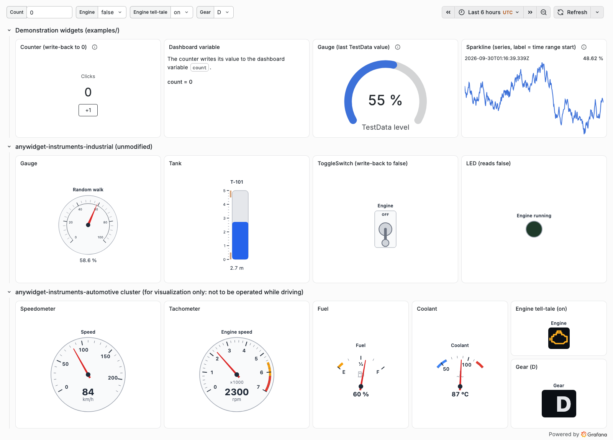
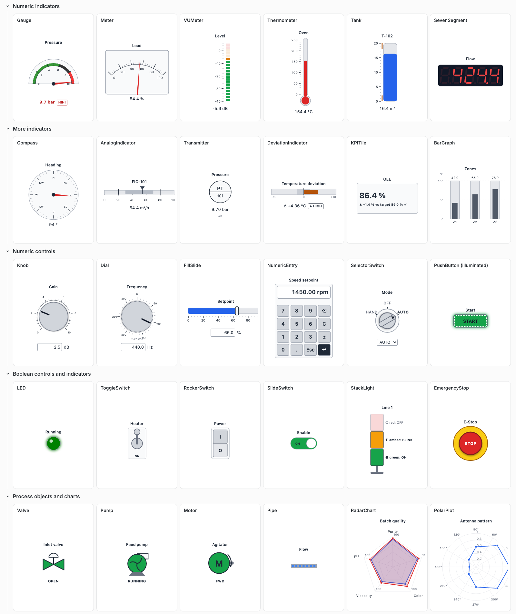
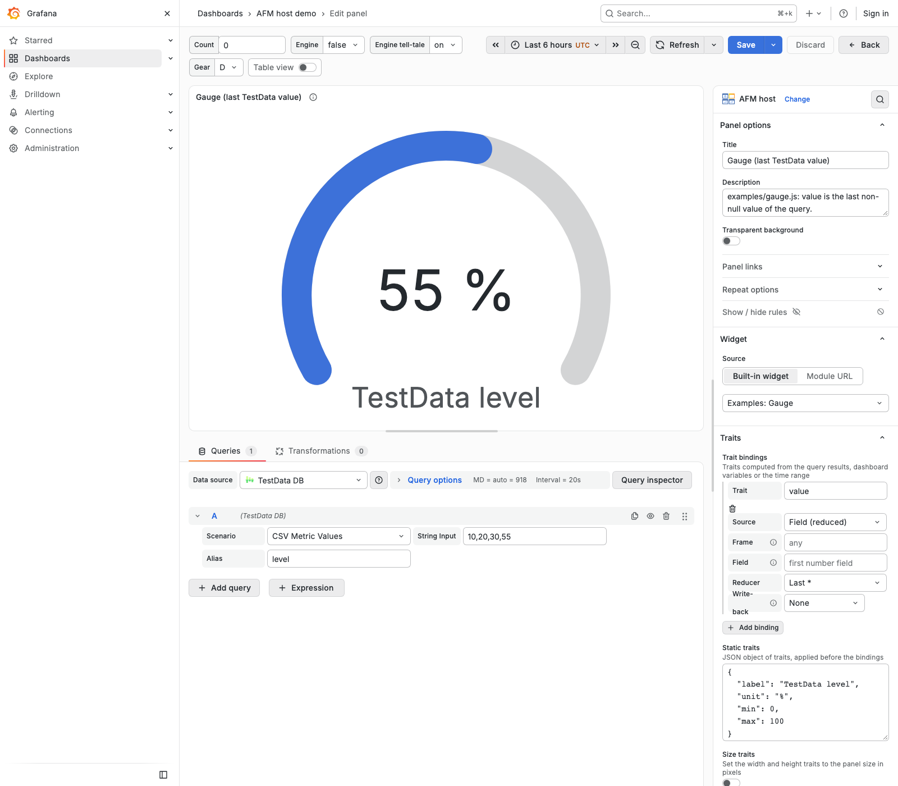

# afm-host-panel

A Grafana panel plugin that hosts anywidget front-end modules (AFM). Widgets
written for Jupyter with [anywidget](https://anywidget.dev) run in Grafana
unchanged: the panel loads the module, gives it an element and a model, and
feeds the model from query results, the time range and dashboard variables.
A widget can write back to a dashboard variable.

Built in: three demonstration widgets, the 52 widgets of
[anywidget-instruments-industrial](https://github.com/AnywidgetInstruments/anywidget-instruments-industrial)
(gauges, tanks, LEDs, switches, seven-segment displays, ...) and the widgets of
[anywidget-instruments-automotive](https://github.com/AnywidgetInstruments/anywidget-instruments-automotive)
(speedometer, tachometer, tell-tales, cluster, ...; for visualization only, no
widget is meant to be operated while driving).
Other AFM modules can be loaded from a URL when the server allows it.

> **Status: initial development (0.0.x).** Not signed, not in the plugin
> catalog. Tested with Grafana OSS 13.2.2.

<picture>
  <source media="(prefers-color-scheme: dark)" srcset="docs/img/demo-dark.png">
  
</picture>

The anywidget-instruments-industrial gallery dashboard: 30 of the 52 built-in
industrial widgets.

<picture>
  <source media="(prefers-color-scheme: dark)" srcset="docs/img/instruments-dark.png">
  
</picture>

The panel editor: choose a widget, set static traits, bind traits to the
query results, a dashboard variable or the time range.

<picture>
  <source media="(prefers-color-scheme: dark)" srcset="docs/img/editor.png">
  
</picture>

## Quick start

```bash
npm ci
npm run build
docker compose up -d        # GRAFANA_PORT=3001 docker compose up -d to change the port
```

Open <http://localhost:3000>, dashboards **AFM host demo** and
**anywidget-instruments-industrial gallery**.

With [just](https://github.com/casey/just): `just install build server`,
`just check`, `just e2e`, `just docs`.

## Documentation

Published at <https://anywidgetinstruments.github.io/afm-host-panel/>; `just docs` builds
it locally from `docs/`:

- [User guide](docs/guide.md): install, choose a widget, bind traits, write back
- [anywidget-instruments-industrial](docs/instruments.md): the 52 built-in instrumentation widgets
- [anywidget-instruments-automotive](docs/automotives.md): the built-in automotive widgets
- [Compatibility and limits](docs/compatibility.md): AFM compatibility matrix
- [Design](docs/design.md), [Specification](docs/specification.md), [Roadmap](docs/roadmap.md)
- [Development](docs/development.md)

## Related projects

| Project | What it is | Documentation |
|---|---|---|
| [anywidget-instruments-industrial](https://github.com/AnywidgetInstruments/anywidget-instruments-industrial) | Instrumentation widgets for notebooks: gauges, tanks, LEDs, switches, charts, alarms, SCADA objects | <https://anywidgetinstruments.github.io/anywidget-instruments-industrial/> |
| [anywidget-instruments-automotive](https://github.com/AnywidgetInstruments/anywidget-instruments-automotive) | Automotive instruments built on anywidget-instruments | <https://anywidgetinstruments.github.io/anywidget-instruments-automotive/> |
| [afm-host-panel](https://github.com/AnywidgetInstruments/afm-host-panel) | Grafana panel plugin that runs anywidget modules, with both libraries built in | <https://anywidgetinstruments.github.io/afm-host-panel/> |

## License

MIT (see `LICENSE`). The vendored anywidget-instruments-industrial and
anywidget-instruments-automotive front ends are BSD-3-Clause
(`src/widgets/anywidget-instruments/LICENSE`,
`src/widgets/anywidget-instruments-automotive/LICENSE`).

Contributing: `CODE_OF_CONDUCT.md`, `SECURITY.md`, `AGENTS.md`.
