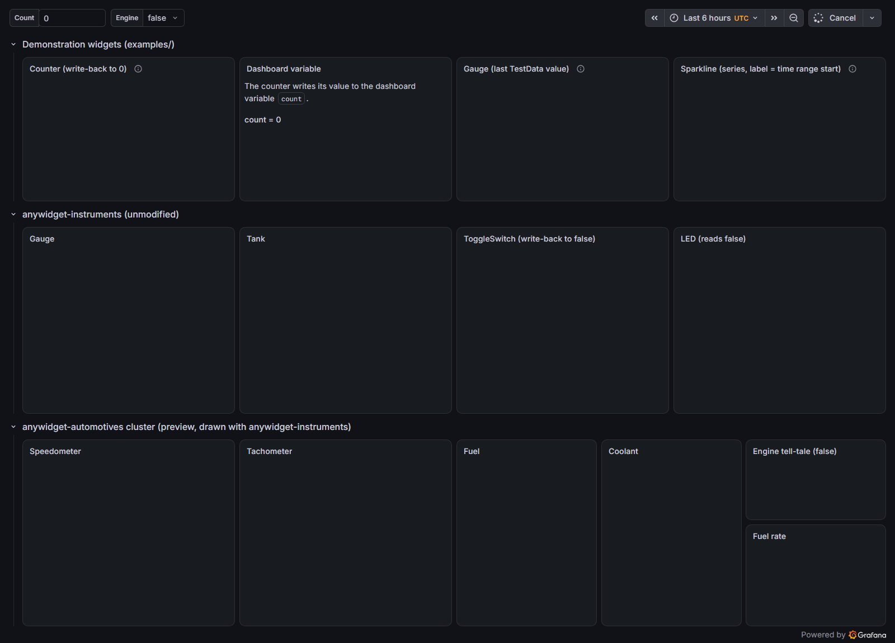
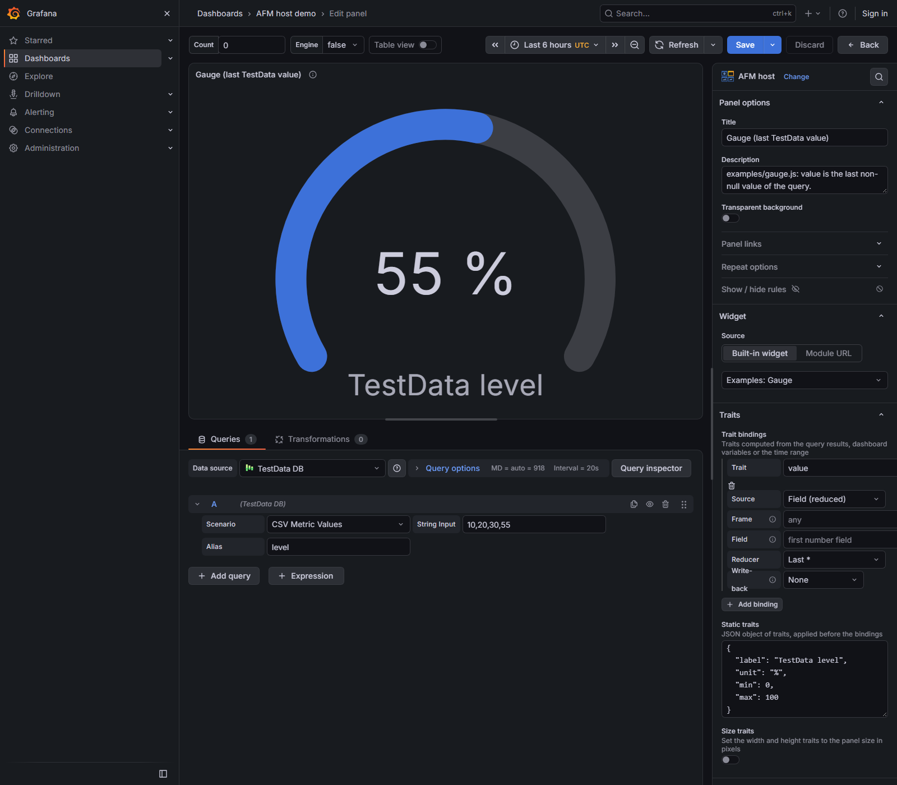

# afm-host-panel

A Grafana panel plugin that hosts anywidget front-end modules (AFM). The
panel loads a widget module, gives it an element and a model, and feeds the
model from Grafana: query results, the time range and dashboard variables.
Widgets written for Jupyter run unchanged, within the limits listed in
[Compatibility and limits](compatibility.md).

The widgets follow the Grafana theme:

The panel editor: choose a widget, set static traits, bind traits to the
query results, a dashboard variable or the time range (see the
[User guide](guide.md)).

Screenshots are taken from the development server with
`node scripts/screenshots.mjs` (see [Development](development.md)).

- [User guide](guide.md): install, choose a widget, bind traits to data.
- [Design](design.md): how the host works and why.
- [Specification](specification.md): requirements (EARS, MoSCoW).
